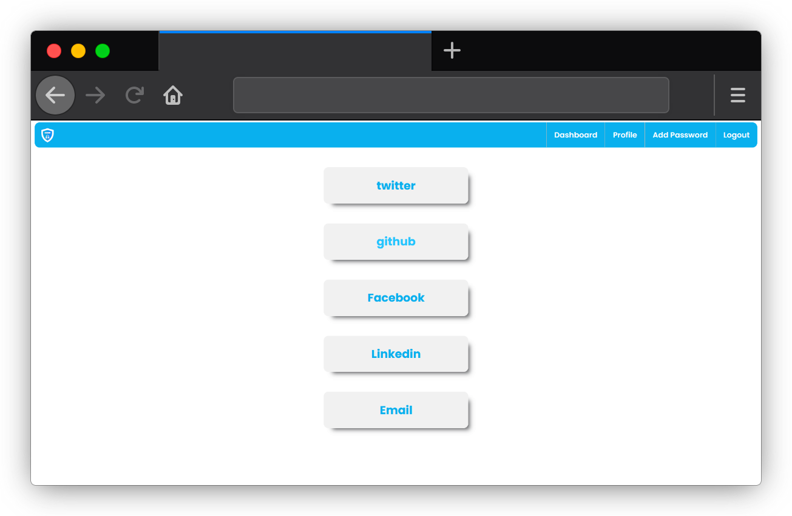
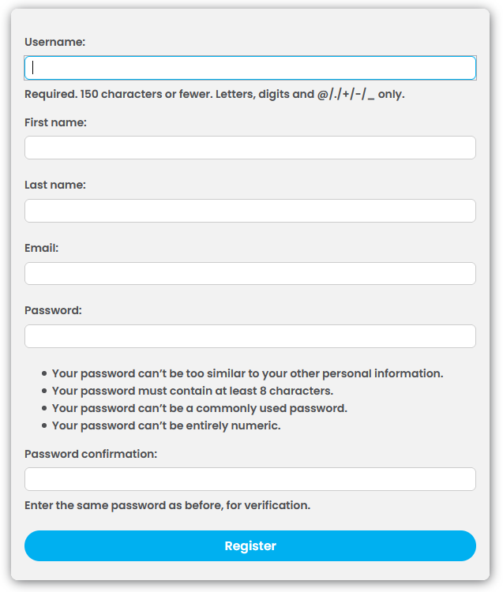
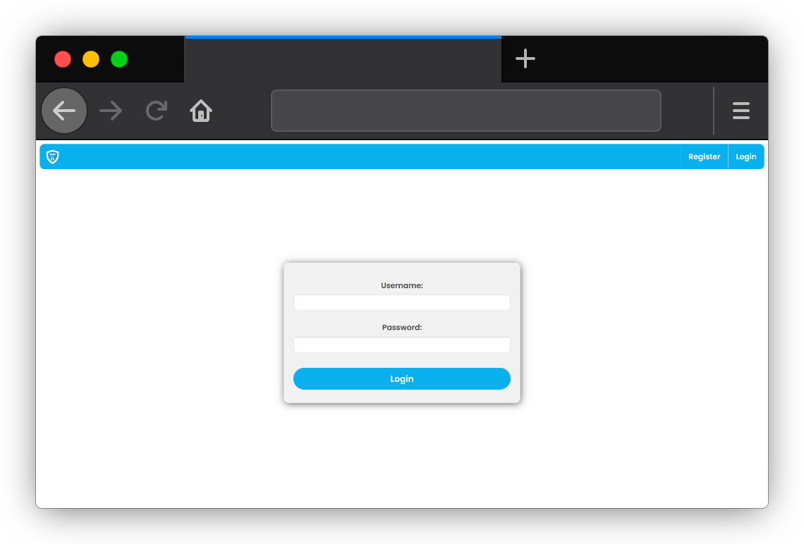
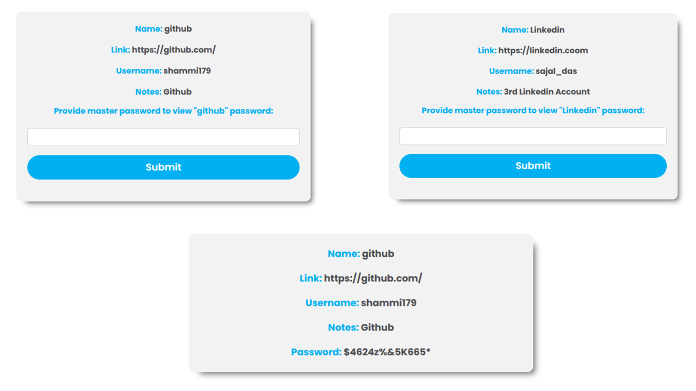
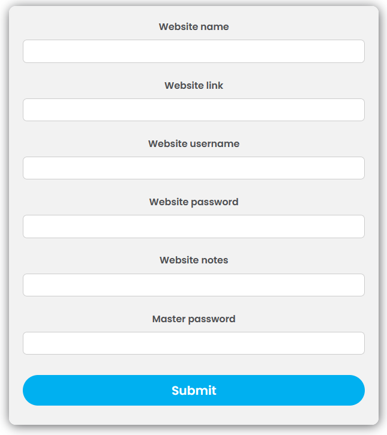
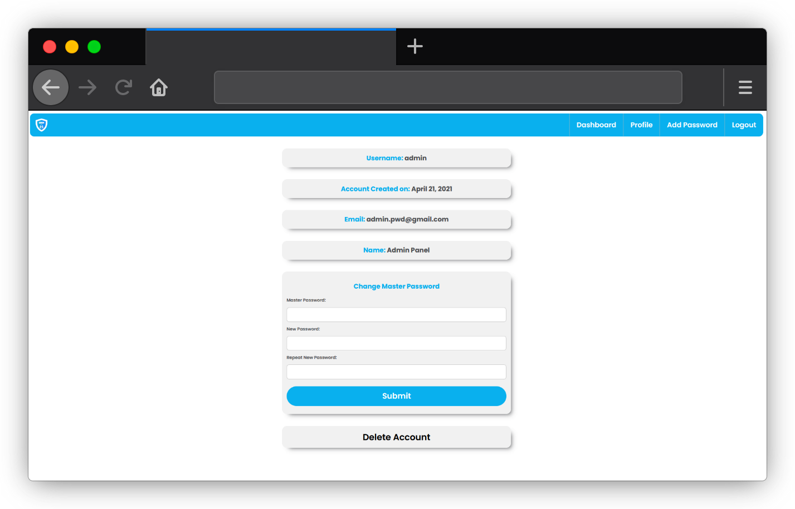
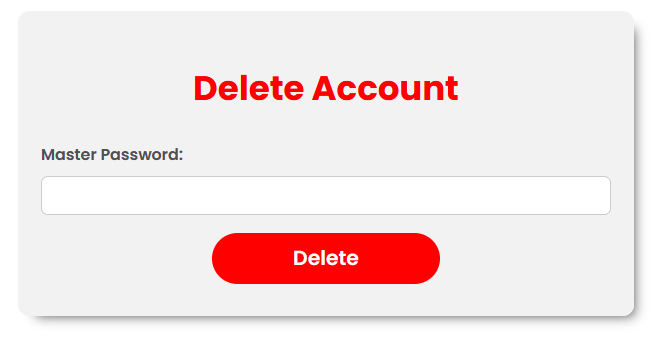

<h2 align="center"><b>Password Defender - Most Secured Password
Manager (Web App)</b> </h2>

Our Website Dashboard

## About Project

This is a project of making our passwords safer. In
this modern era, many of us are fear of their passwords that
where they can store their passwords. That’s why we decided
to create a platform where people can store their passwords
along with their important credentials. And this project is about
a Password Manager Web Application where people can store
their password safely. In this application, users have to create
their own account making their valuable and unique password
and then they can enjoy the features of this web app. Here, User
can store their password, can see their password. But if they
want to see their stored password, they have to use their master
password to unlock this as we stored these passwords safely in
our database and these passwords stored in an encrypted way
using <b>Crypto Module-Advanced Encryption Standard where the
encryption method is base64 and SHA256</b>. Here, user can see
his/her own vault that means for which websites, they stored their
passwords. This Web App is the extended version of our desktop
Application which was implemented by our own algorithm named
<b>SSD Algorithm (Sajal Shammi Dual Encryption Decryption
Algorithm)</b> which is used to encrypt and decrypt passwords.
Using this algorithm, we have encrypted all the passwords saved
in our database, even if anyone have our database where we
store the passwords, he/she cannot decrypt this. In addition, in
our Web App, we have implemented a different algorithm using
Django which is also safe for store password and these passwords
are also stored in database in an encrypted way 

#### This Project is made using Django, HTML, CSS.

  

Register

Login

Detail View

  

Add Password

Profile

  

Delete

### Team - Dynamic Duo
  [Shumaiya Akter Shammi](https://github.com/Shammi179) 
  [Sajal Das](https://github.com/sajaldas19)  
 
